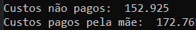

# Página 1
    Qual é a data??
    Tem um comentário a dizer que fez 250€ ao gil??
# Página 2
    2/10/2017
    Os 350€ foram pagos pelo Ricardo que inclui a pintura do depósito e o resto (sem ser os pneus, pagos pela mãe) que ficou danificado quando ele caiu. 

    Os não pagos são os 150€ extra dos 350€ pagos.
# Página 3
    A partir de 4/2017
    Só não sei
# Página 4
    22/4/1017
    Deve ter acontecido
# Página 5
    6/7/2018
    Não é meu
# Página 6
    20/2/2019
    Pneus 26? Não é meu
# Página 7
    2/4/2019
    Meu (aparece na página 3)
# Página 8
    4/9/2019
    Camera de ar 26 não é meu
# Página 9
    2/10/2017
    página 2 repetida
# Página 10
    8/6/2020
    Meu
# Página 11
    8/6/2020
    Meu
# Página 12
    30/11/2020
    Mesmo Meu (acho)
# Página 13
    20/8/2021
    Mesmo Meu
# Página 14
    22/8/2022
    Mesmo Meu
# Página 15
    30/12/2019
    Inicio é a página 7
    meio não é meu
    fim Meu

